# Terraform Secure SIEM Log Archive on AWS

This project demonstrates how I used Terraform to deploy AWS infrastructure for a basic SIEM/security log archive use case.

The goal was to learn Terraform fundamentals by building a realistic cloud security workflow: authenticating to AWS, configuring Terraform, creating infrastructure as code, running the Terraform deployment lifecycle, and verifying the deployed AWS S3 bucket.

---

## Technologies Used

- Terraform
- AWS S3
- AWS IAM
- AWS CLI
- PowerShell
- VS Code

---

## What This Project Does

This project uses Terraform to create an AWS S3 bucket that can be used as a basic security log archive for SIEM or data lake workflows.

The project demonstrates:

- AWS IAM user creation
- AWS access key generation
- AWS CLI authentication
- Terraform provider configuration
- Terraform initialization
- Terraform planning
- Terraform deployment
- AWS S3 bucket creation
- Terraform project file structure

---

## Step 1: IAM Dashboard

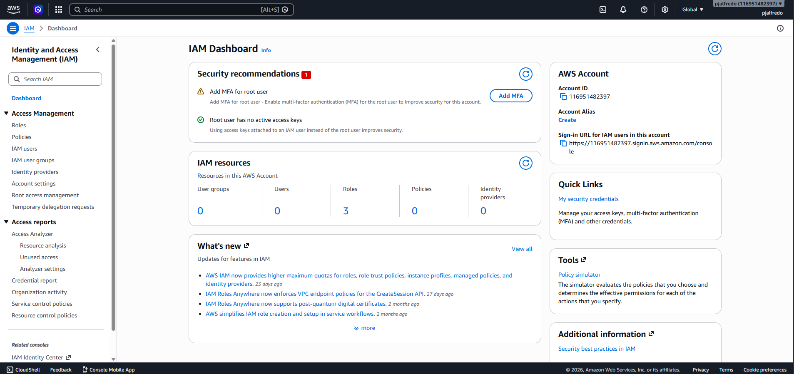

This screenshot shows the AWS IAM dashboard.  
I started here because Terraform needs permission to create AWS resources. IAM is where users, permissions, and access keys are managed.

---

## Step 2: Terraform IAM User Created

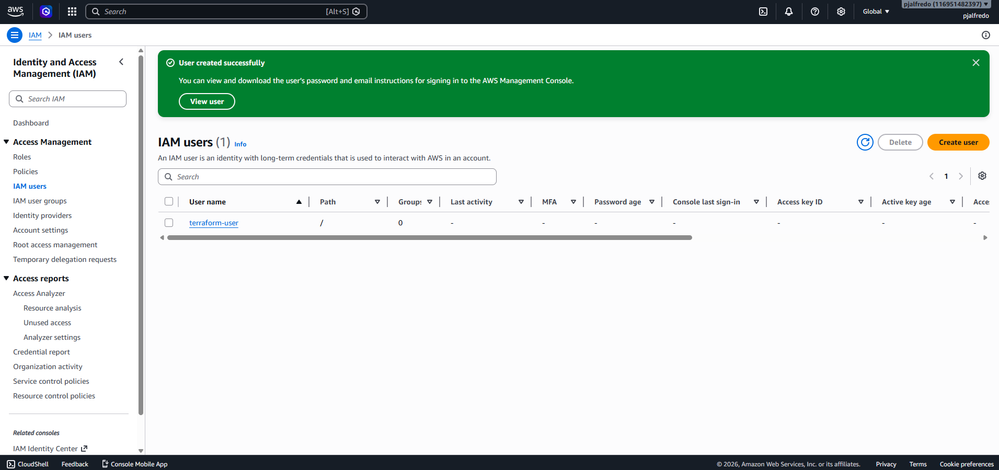

This screenshot shows the IAM user created for Terraform.  
I created a dedicated IAM user so Terraform could authenticate to AWS instead of using the AWS root account.

---

## Step 3: Access Key Creation

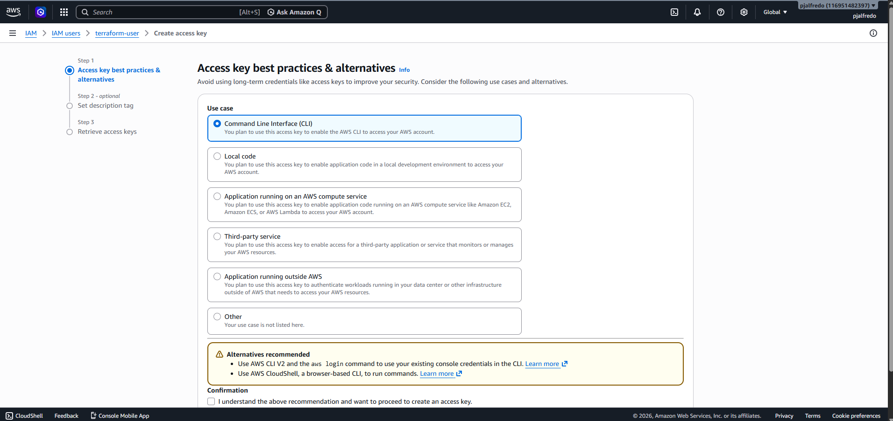

This screenshot shows the access key creation process.  
The access key allows Terraform and AWS CLI to authenticate to AWS from PowerShell.

The access key includes:

- Access Key ID
- Secret Access Key

These credentials are used locally through `aws configure`.

---

## Step 4: AWS CLI Configuration

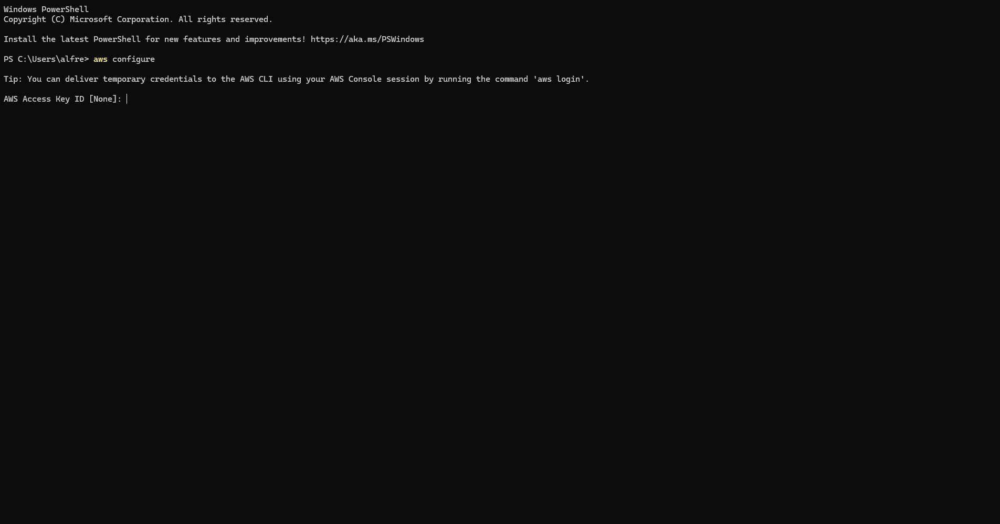

This screenshot shows AWS CLI being configured in PowerShell.

I ran:

```powershell
aws configure
```

Then entered:

- AWS Access Key ID
- AWS Secret Access Key
- Default region
- Output format

This allowed my local machine to authenticate to AWS.

---

## Step 5: AWS Authentication Verified

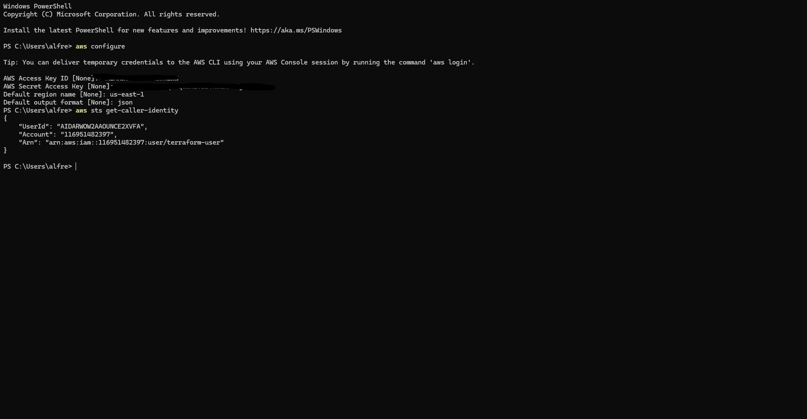

This screenshot shows successful AWS authentication.

I verified my AWS credentials by running:

```powershell
aws sts get-caller-identity
```

This confirms that AWS CLI can communicate with my AWS account.

---

## Step 6: Terraform Initialized

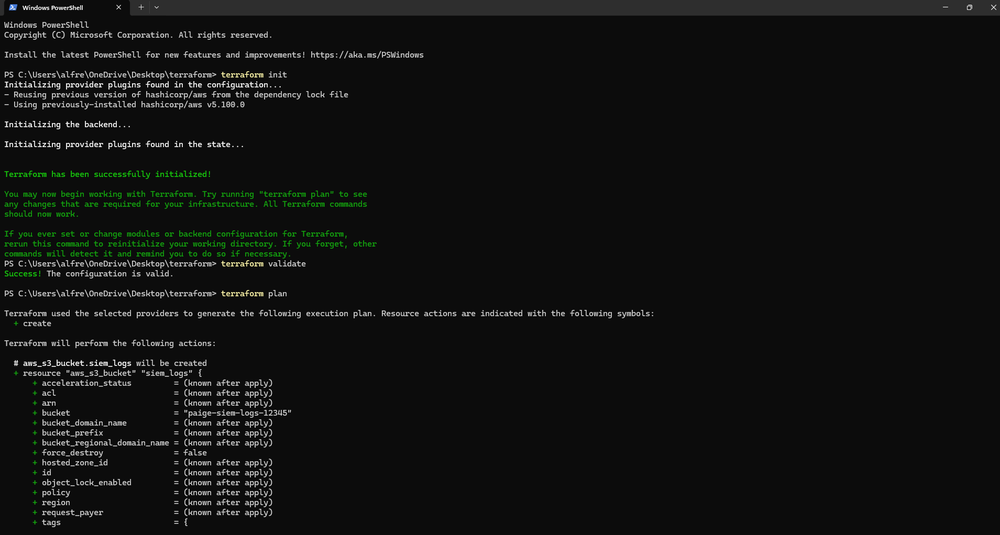

This screenshot shows Terraform initialization.

I ran:

```powershell
terraform init
```

This downloaded the AWS provider plugin and prepared the project folder for Terraform commands.

---

## Step 7: Terraform Plan

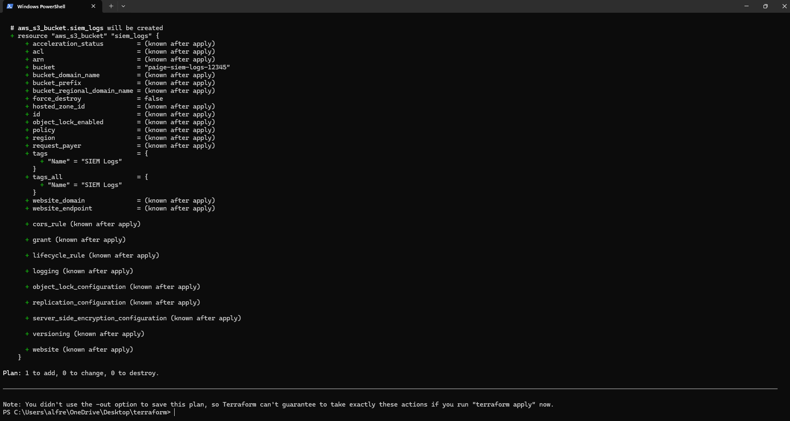

This screenshot shows the Terraform plan command.

I ran:

```powershell
terraform plan
```

Terraform reviewed my code and showed what AWS resources it planned to create before deployment.

---

## Step 8: Terraform Plan Details

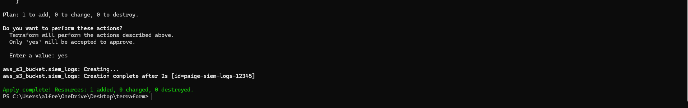

This screenshot shows the detailed Terraform execution plan.

Terraform identified that it would create an AWS S3 bucket based on the code inside `main.tf`.

---

## Step 9: Terraform Apply

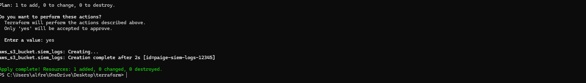

This screenshot shows Terraform applying the configuration.

I ran:

```powershell
terraform apply
```

Then confirmed the deployment by typing:

```text
yes
```

Terraform then created the AWS S3 bucket.

---

## Step 10: S3 Bucket Created in AWS

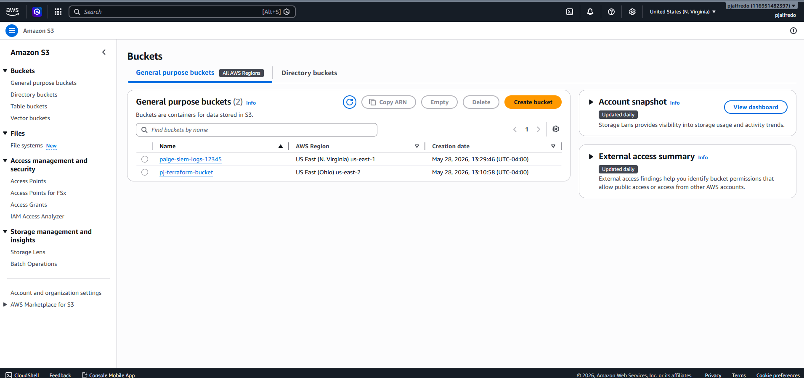

This screenshot shows the S3 bucket successfully created in AWS.

This confirms that Terraform deployed real AWS infrastructure from code.

---

## Step 11: main.tf Infrastructure Code

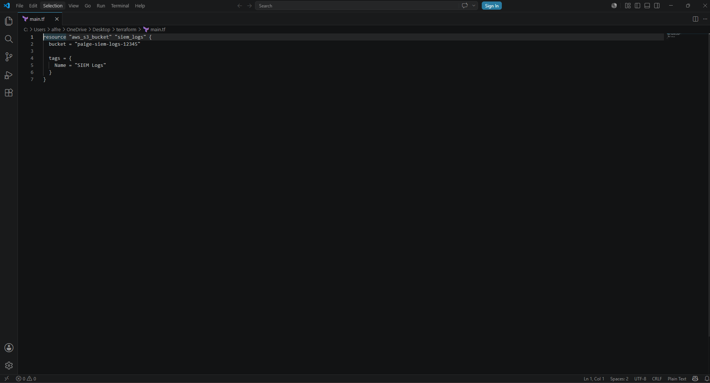

This screenshot shows the `main.tf` file.

The `main.tf` file defines the AWS S3 bucket resource Terraform creates.

Example:

```hcl
resource "aws_s3_bucket" "siem_logs" {
  bucket = "paige-siem-logs-12345"

  tags = {
    Name = "SIEM Logs"
  }
}
```

---

## Step 12: provider.tf Configuration

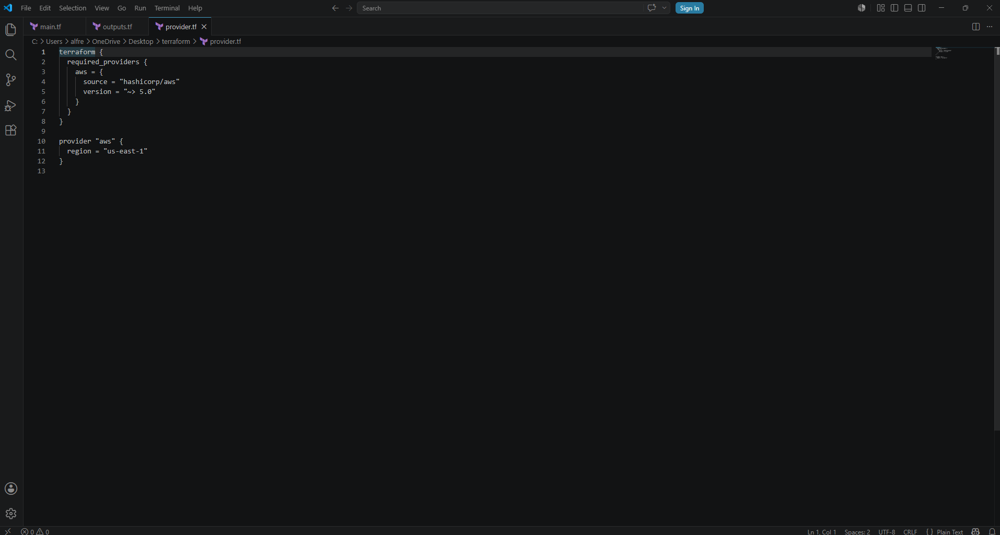

This screenshot shows the `provider.tf` file.

The provider file tells Terraform to use AWS and deploy resources into the selected AWS region.

---

## Step 13: Project Documentation

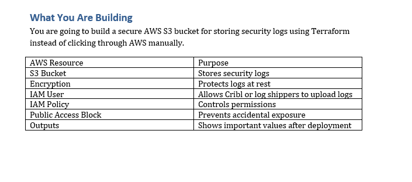

This screenshot shows the project planning/documentation used while building the lab.

It outlines the purpose of the project, the Terraform files, and the AWS resources being created.

---

## Step 14: Final Project Files

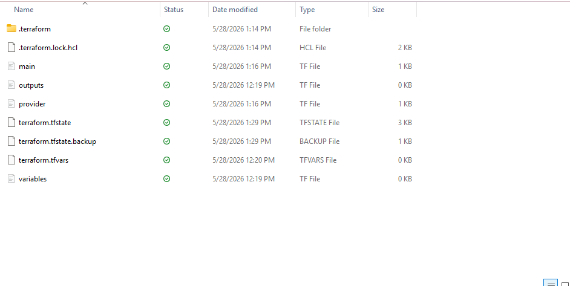

This screenshot shows the final Terraform project files.

The project includes:

- `main.tf`
- `provider.tf`
- `variables.tf`
- `outputs.tf`
- `terraform.tfvars`
- `.terraform.lock.hcl`
- `terraform.tfstate`

These files represent the complete Terraform project structure.

---

## Terraform Files Explained

### provider.tf

Defines the AWS provider and region.

```hcl
terraform {
  required_providers {
    aws = {
      source = "hashicorp/aws"
      version = "~> 5.0"
    }
  }
}

provider "aws" {
  region = "us-east-1"
}
```

### main.tf

Defines the AWS S3 bucket resource.

```hcl
resource "aws_s3_bucket" "siem_logs" {
  bucket = "paige-siem-logs-12345"

  tags = {
    Name = "SIEM Logs"
  }
}
```

### terraform.tfstate

Tracks the infrastructure Terraform created.

Terraform uses this file to know what already exists in AWS.

---

## Commands Used

```powershell
aws configure
aws sts get-caller-identity
terraform init
terraform validate
terraform plan
terraform apply
```

---

## What I Learned

Through this project, I learned how to:

- Install and configure Terraform
- Authenticate to AWS using IAM access keys
- Use AWS CLI with Terraform
- Write basic Terraform configuration files
- Initialize a Terraform project
- Preview infrastructure changes before deployment
- Deploy AWS infrastructure using code
- Verify deployed resources in AWS
- Understand Terraform state files

---

## Security Relevance

This project connects directly to cloud security and SIEM engineering because S3 buckets are commonly used for:

- Security log storage
- SIEM archive storage
- CloudTrail log storage
- Detection engineering datasets
- Data lake ingestion workflows

By using Terraform, this infrastructure can be deployed consistently, documented clearly, and version-controlled in GitHub.

---

## Future Improvements

Future improvements could include:

- Enabling S3 encryption
- Blocking public access
- Adding IAM least-privilege policies
- Adding lifecycle rules for old logs
- Adding Terraform variables
- Adding Terraform outputs
- Using remote Terraform state
- Adding GitHub Actions for CI/CD deployment

---

## Author

Paige Alfred  
GitHub: https://github.com/paigealfred
